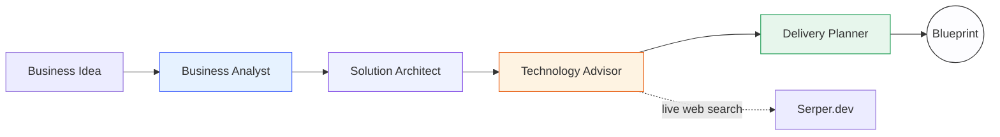

<p align="center">
  
</p>


<p align="center">
  <b>From idea ➜ implementable solution blueprint in minutes.</b><br/>
  A <b>multi-agent AI consulting system</b> that researches, architecturally designs, and plans
  a production-ready solution for your business idea — powered by <b>CrewAI</b> agents,
  <b>FastAPI</b> streaming, and <b>MongoDB Atlas</b>.
</p>

<p align="center">
  
  
  
  
  
  
  
</p>

---

## 🚀 What does it do?

Describe a business idea once — **SolutionForge AI** assembles a team of four specialised AI consultants
who collaborate **in sequence**, each one building on the last, and delivers a rich, decision-ready
**Solution Blueprint** (HTML) covering:

- ✅ Who it's for & what it should do
- ✅ A scalable cloud architecture
- ✅ A concrete technology stack (with alternatives & trade-offs)
- ✅ A delivery plan with effort, risks, and milestones

All while you **watch every agent work live** — progress streams to the browser in real time via
**Server-Sent Events (SSE)**.

---

## 🧠 How it works — the agent team

```
business_idea
     │
     ▼
┌─────────────────────┐        ┌──────────────────────┐
│  1. Business Analyst │───────▶│ 2. Solution Architect │
│  persona, value prop,│ builds │  cloud-native         │
│  goals, constraints  │  on    │  architecture + data  │
└─────────────────────┘        └──────────────────────┘
     ▲                                        │
     │          ┌─────────────────────────────┘
     │          ▼
┌──────────────────────┐        ┌─────────────────────┐
│ 4. Delivery Planner  │◀───────│ 3. Technology Advisor│
│  milestones, effort, │  poll  │  stack + Serper.dev  │
│  risks, test plan    │        │  live web research   │
└─────────────────────┘        └─────────────────────┘
     │
     ▼
  ⚒️ Solution Blueprint (HTML)
```



---

## ✨ Features

| | | |
|---|---|---|
| 🧑‍💼 **4 CrewAI agents** | Sequential CrewAI `Process.sequential` with context chaining — each agent consumes the previous outputs. | `backend/services/orchestration.py` |
| 📡 **Live streaming** | Background thread + `Queue` → SSE `data:` events → real-time progress pills & tabs. Never blocks the server. | `backend/services/crew_service.py` |
| 🌍 **Real web research** | Technology Advisor searches the web via **Serper.dev** to validate current best-practice stacks. | `backend/agents/technology_advisor.py` |
| 🛡️ **Defence-in-depth** | Frontend validation → Pydantic models → **prompt-injection guardrail** (heuristic + LLM check) → output sanitisation. | `backend/agents/_prompt_safety.py` |
| 🔐 **Full auth** | bcrypt password hashing + JWT bearer tokens, email **or** username login. | `backend/core/security.py` |
| 📄 **Standalone blueprints** | Self-contained HTML report with embedded CSS, **Mermaid architecture diagram**, and logo. | `backend/utils/blueprint_generator.py` |
| 🗃️ **MongoDB Atlas** | Two collections (`users`, `consultations`) with composite indexes + per-user ownership checks. | `backend/db/database.py` |
| 📜 **Auto docs** | Interactive OpenAPI docs at `/docs`. | FastAPI |

---

## 🧰 Tech Stack

| Layer | Technology |
|---|---|
| Frontend | Streamlit, httpx-sse, streamlit-mermaid |
| Backend | FastAPI, Uvicorn, Pydantic v2, sse-starlette |
| Agent framework | CrewAI 1.15 |
| LLMs | **Cohere** `command-a-03-2025` (crew) · **Gemini** `gemini-3.5-flash-lite` (tech advisor + guardrail) |
| Web research | Serper.dev |
| Database | MongoDB Atlas (PyMongo) |
| Security | bcrypt, PyJWT, python-dotenv |
| Language | Python 3.13 |

---

## 📁 Project structure

```
Solution-Forge-AI/
├── backend/                      # FastAPI application
│   ├── main.py                   # App entry point + /health
│   ├── core/                     # config, security (bcrypt/JWT), LLM factory, sanitise
│   ├── agents/                   # 4 CrewAI agents + prompt-injection guardrail
│   ├── services/                 # crew runner (thread+queue+SSE), blueprint service
│   ├── routers/                  # /auth and /consultations endpoints
│   ├── models/                   # Pydantic request/response models
│   ├── schemas/                  # Response schemas
│   ├── db/                       # Mongo driver (users, consultations)
│   ├── utils/                    # HTML blueprint + Mermaid diagram renderers
│   └── judge/                    # (roadmap) quality-scoring judge module
├── frontend/                     # Streamlit UI
│   ├── app.py                    # Entry point
│   ├── views/                    # auth, consultation, live results, chat history
│   ├── api_client.py             # REST + SSE client
│   ├── validators.py             # First-pass form validation
│   ├── models.py                 # Mirrored dataclasses
│   └── assets/                   # Logo assets
├── tracking/                     # Dev tracking notes & decision logs
└── requirements.txt
```

---

## 🚦 Getting started

### Prerequisites
- Python **3.13+**
- A **MongoDB Atlas** cluster (or local MongoDB)
- API keys: **Cohere**, **Google Gemini**, **Serper.dev**

### 1. Clone & install

```bash
git clone https://github.com/sudipmondal7205/Solution-Forge-AI.git
cd Solution-Forge-AI
pip install -r requirements.txt
```

### 2. Configure environment — create `.env` at the repo root

```env
# Database
MONGO_URI=mongodb+srv://<user>:<pass>@<cluster>/<db>
MONGO_DB=solutionforge

# Auth
JWT_SECRET=change-me-to-a-long-random-string
JWT_ALGORITHM=HS256
JWT_EXPIRY_MINUTES=120

# LLMs & search
COHERE_API_KEY=your-cohere-key
GEMINI_API_KEY=your-gemini-key
SERPER_API_KEY=your-serper-key
```

### 3. Run the backend

```bash
uvicorn backend.main:app --reload
```
API becomes available at `http://localhost:8000` — interactive docs at **`http://localhost:8000/docs`**.

### 4. Run the frontend

```bash
cd frontend
streamlit run app.py
```
Open the browser at the printed URL (default **`http://localhost:8501`**), register, and generate your first blueprint. 🎉

---

## 🔌 API reference

| Method | Endpoint | Auth | Purpose |
|---|---|---|---|
| `POST` | `/auth/register` | — | Create account (hashed password) → returns JWT |
| `POST` | `/auth/login` | — | Login with email or username → returns JWT |
| `GET`  | `/health` | — | API + MongoDB reachability (`ping`) |
| `POST` | `/consultations` | ✅ | Start the 4-agent pipeline → **SSE stream** |
| `GET`  | `/consultations` | ✅ | Current user's history (newest first) |
| `GET`  | `/consultations/{id}` | ✅ | One consultation + all stored agent outputs |
| `GET`  | `/consultations/{id}/blueprint` | ✅ | Standalone HTML blueprint |

---

## 🔐 Security & quality

- **Passwords** — stored only as bcrypt hashes with unique salts; never plain text.
- **Auth** — stateless **JWT** (`sub` + `exp`) verified via dependency injection on every protected route.
- **Ownership** — every read re-checks `doc.user_id == user_id` (404/403).
- **Prompt injection** — input is validated *before* agents run: heuristic keyword scan → **LLM-based** check → rendered input block is neutralised before entering agent prompts.
- **Output safety** — agent outputs are sanitised (dangerous HTML/scripts stripped) before render.

---

## 🧭 Roadmap & limitations

- **⚖️ Quality-scoring Judge** — design exists in `backend/judge/` (rubric, penalties, quality bands) but is not yet wired into the live pipeline. Goal: every blueprint gets an automated quality score.
- **💬 Conversational iterations** — currently one-shot per submission; planned to support chat-style follow-ups on a blueprint.
- **🧵 Concurrency hardening** — thread-per-run works for an MVP; next step is a task queue + rate limiting for scale.
- **♻️ Failure persistence** — errors are streamed live but not yet stored on the consultation record.

---

## 👨‍💻 Built with

[CrewAI](https://www.crewai.com) · [FastAPI](https://fastapi.tiangolo.com) · [Streamlit](https://streamlit.io) · [MongoDB Atlas](https://www.mongodb.com/atlas) · [Cohere](https://cohere.com) · [Google Gemini](https://deepmind.google/technologies/gemini/) · [Serper.dev](https://serper.dev)

<p align="center">Made with 💙 for the Cognizant Hackathon</p>
